# [📈 Live Status](https://codextde.github.io/uptime): <!--live status--> **🟧 Partial outage**

This repository contains the open-source uptime monitor and status page for [Codext GmbH](https://codext.de/), powered by [Upptime](https://github.com/upptime/upptime).

With [Upptime](https://upptime.js.org), you can get your own unlimited and free uptime monitor and status page, powered entirely by a GitHub repository. We use [Issues](https://github.com/codextde/uptime/issues) as incident reports, [Actions](https://github.com/codextde/uptime/actions) as uptime monitors, and [Pages](https://codextde.github.io/uptime) for the status page.

<!--start: status pages-->
<!-- This summary is generated by Upptime (https://github.com/upptime/upptime) -->
<!-- Do not edit this manually, your changes will be overwritten -->
<!-- prettier-ignore -->
| URL | Status | History | Response Time | Uptime |
| --- | ------ | ------- | ------------- | ------ |
|  [Codext Website](https://codext.de/) | 🟩 Up | [codext-website.yml](https://github.com/codextde/uptime/commits/HEAD/history/codext-website.yml) | 

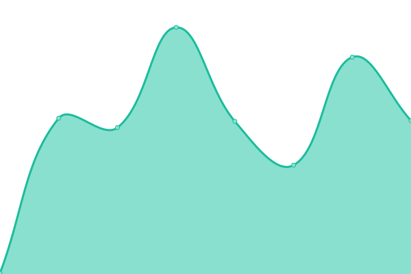 165ms
     
 | 

<a href="https://codextde.github.io/uptime/history/codext-website">100.00%</a>
    

|  [Codext Analytics](https://analytics.codext.de/) | 🟩 Up | [codext-analytics.yml](https://github.com/codextde/uptime/commits/HEAD/history/codext-analytics.yml) | 

 604ms
     
 | 

<a href="https://codextde.github.io/uptime/history/codext-analytics">100.00%</a>
    

|  [Codext Link](https://codext.link/) | 🟩 Up | [codext-link.yml](https://github.com/codextde/uptime/commits/HEAD/history/codext-link.yml) | 

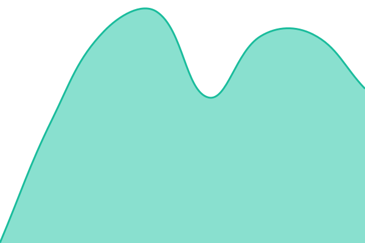 463ms
     
 | 

<a href="https://codextde.github.io/uptime/history/codext-link">100.00%</a>
    

|  [Codext Server - Server01](https://server01.codext.de:8443/) | 🟩 Up | [codext-server-server01.yml](https://github.com/codextde/uptime/commits/HEAD/history/codext-server-server01.yml) | 

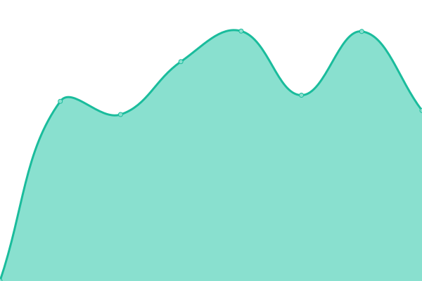 1597ms
     
 | 

<a href="https://codextde.github.io/uptime/history/codext-server-server01">100.00%</a>
    

|  [Codext Server - Lara](https://lara.codext.de:8006/) | 🟩 Up | [codext-server-lara.yml](https://github.com/codextde/uptime/commits/HEAD/history/codext-server-lara.yml) | 

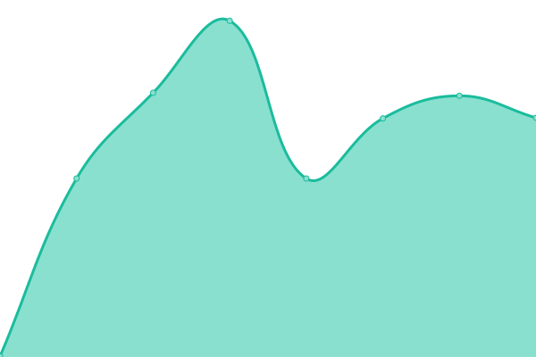 431ms
     
 | 

<a href="https://codextde.github.io/uptime/history/codext-server-lara">100.00%</a>
    

|  [Webaro Cloud](https://webaro.cloud/) | 🟩 Up | [webaro-cloud.yml](https://github.com/codextde/uptime/commits/HEAD/history/webaro-cloud.yml) | 

 455ms
     
 | 

<a href="https://codextde.github.io/uptime/history/webaro-cloud">100.00%</a>
    

|  [Codext Sentry](https://sentry.codext.de/) | 🟩 Up | [codext-sentry.yml](https://github.com/codextde/uptime/commits/HEAD/history/codext-sentry.yml) | 

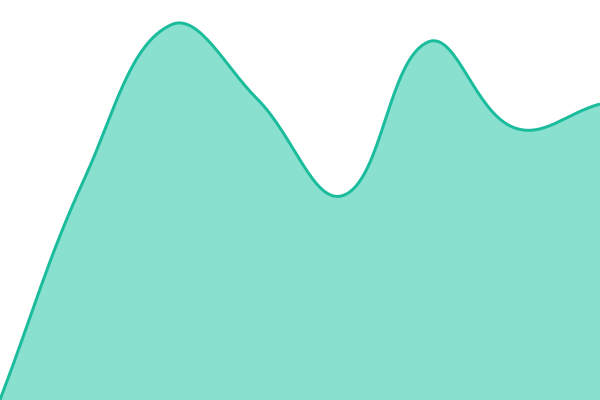 1315ms
     
 | 

<a href="https://codextde.github.io/uptime/history/codext-sentry">100.00%</a>
    

|  [Codext Cloud](https://codext.cloud/) | 🟩 Up | [codext-cloud.yml](https://github.com/codextde/uptime/commits/HEAD/history/codext-cloud.yml) | 

 424ms
     
 | 

<a href="https://codextde.github.io/uptime/history/codext-cloud">100.00%</a>
    

|  [convertAny](https://convert-any.com/) | 🟩 Up | [convert-any.yml](https://github.com/codextde/uptime/commits/HEAD/history/convert-any.yml) | 

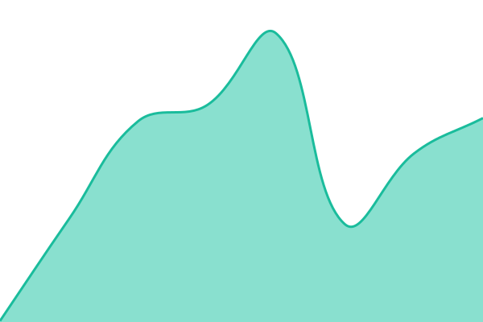 152ms
     
 | 

<a href="https://codextde.github.io/uptime/history/convert-any">100.00%</a>
    

|  [PayStory API](https://api.paystory.de/) | 🟩 Up | [pay-story-api.yml](https://github.com/codextde/uptime/commits/HEAD/history/pay-story-api.yml) | 

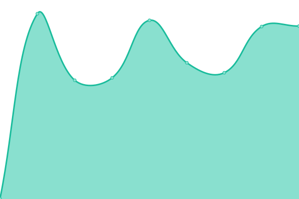 495ms
     
 | 

<a href="https://codextde.github.io/uptime/history/pay-story-api">100.00%</a>
    

|  [Smartbell API](https://api.smartbell.codext.de/v1) | 🟩 Up | [smartbell-api.yml](https://github.com/codextde/uptime/commits/HEAD/history/smartbell-api.yml) | 

 434ms
     
 | 

<a href="https://codextde.github.io/uptime/history/smartbell-api">100.00%</a>
    

|  [WeTwo API](https://api.we-two.de/apple-app-site-association) | 🟩 Up | [we-two-api.yml](https://github.com/codextde/uptime/commits/HEAD/history/we-two-api.yml) | 

 472ms
     
 | 

<a href="https://codextde.github.io/uptime/history/we-two-api">100.00%</a>
    

|  [Codext Customer 1](168.119.226.168) | 🟩 Up | [codext-customer-1.yml](https://github.com/codextde/uptime/commits/HEAD/history/codext-customer-1.yml) | 

 113ms
     
 | 

<a href="https://codextde.github.io/uptime/history/codext-customer-1">100.00%</a>
    

|  [GGM Gastro DK](https://ggmgastro.dk/) | 🟩 Up | [ggm-gastro-dk.yml](https://github.com/codextde/uptime/commits/HEAD/history/ggm-gastro-dk.yml) | 

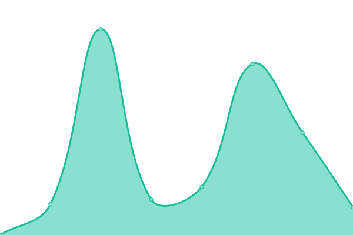 547ms
     
 | 

<a href="https://codextde.github.io/uptime/history/ggm-gastro-dk">100.00%</a>
    

|  [GGM Gastro NO](https://ggmgastro.no/) | 🟩 Up | [ggm-gastro-no.yml](https://github.com/codextde/uptime/commits/HEAD/history/ggm-gastro-no.yml) | 

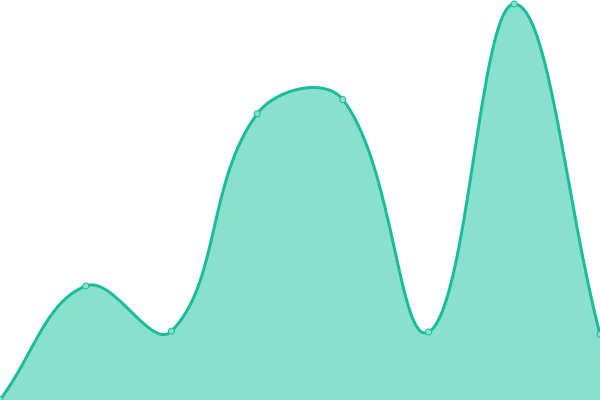 535ms
     
 | 

<a href="https://codextde.github.io/uptime/history/ggm-gastro-no">100.00%</a>
    

|  [GGM SAP Export](https://ggm-sap-sync.codext.de) | 🟩 Up | [ggm-sap-export.yml](https://github.com/codextde/uptime/commits/HEAD/history/ggm-sap-export.yml) | 

 574ms
     
 | 

<a href="https://codextde.github.io/uptime/history/ggm-sap-export">100.00%</a>
    

|  [Shopify Chatbot](https://shopify-chatbot.codext.de/) | 🟥 Down | [shopify-chatbot.yml](https://github.com/codextde/uptime/commits/HEAD/history/shopify-chatbot.yml) | 

 0ms
     
 | 

<a href="https://codextde.github.io/uptime/history/shopify-chatbot">0.00%</a>
    

|  [Codext GmbH - Coolify](https://coolify.codext.de/) | 🟥 Down | [codext-gmb-h-coolify.yml](https://github.com/codextde/uptime/commits/HEAD/history/codext-gmb-h-coolify.yml) | 

 0ms
     
 | 

<a href="https://codextde.github.io/uptime/history/codext-gmb-h-coolify">0.00%</a>
    

|  [Solakon App API](https://api.app.solakon.de) | 🟩 Up | [solakon-app-api.yml](https://github.com/codextde/uptime/commits/HEAD/history/solakon-app-api.yml) | 

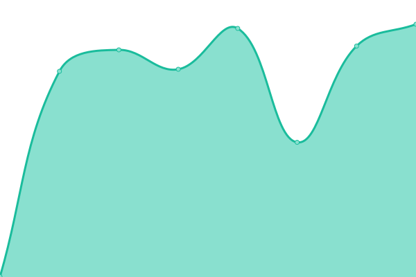 636ms
     
 | 

<a href="https://codextde.github.io/uptime/history/solakon-app-api">100.00%</a>
    

|  [Solakon App DB](https://db.app.solakon.de) | 🟥 Down | [solakon-app-db.yml](https://github.com/codextde/uptime/commits/HEAD/history/solakon-app-db.yml) | 

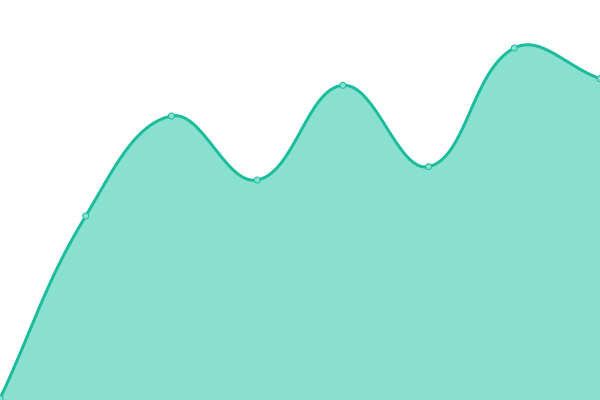 51ms
     
 | 

<a href="https://codextde.github.io/uptime/history/solakon-app-db">0.00%</a>
    

<!--end: status pages-->

[**Visit our status website →**](https://codextde.github.io/uptime)

## 📄 License

- Powered by: [Upptime](https://github.com/upptime/upptime)
- Code: [MIT](./LICENSE) © [Codext GmbH](https://codext.de/)
- Data in the `./history` directory: [Open Database License](https://opendatacommons.org/licenses/odbl/1-0/)
